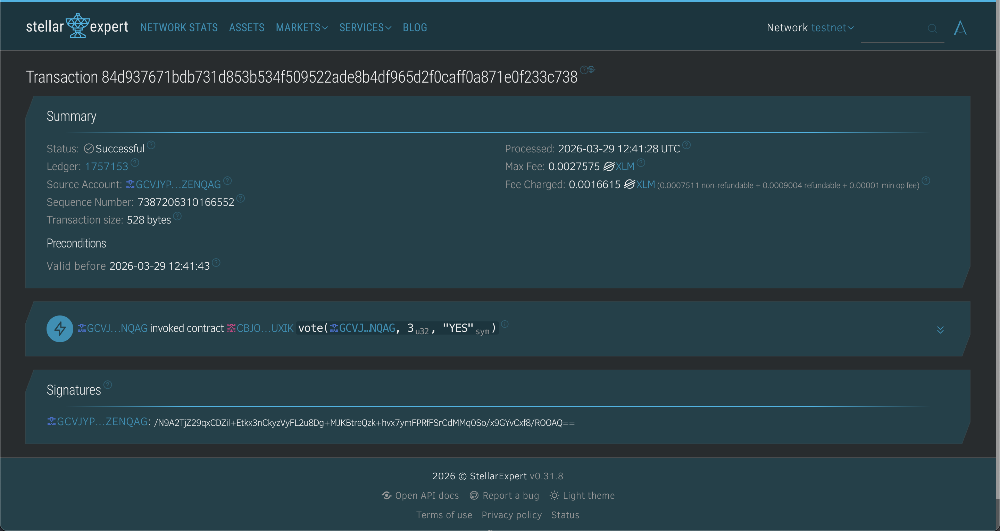

# Live Poll — Stellar Level 3

**Demo Video:** https://drive.google.com/file/d/1WHiRyIe6Z5AsiNmBBOtoiLF2GQHrz9fD/view?usp=sharing


A single question on-chain poll built on **Soroban** smart contracts (Stellar Testnet).  
Connect any Stellar wallet, vote Yes or No, and watch live results update every 5 seconds all on chain, with instant cached display.

**Live Demo:** https://live-poll-t3.vercel.app/  

---

## Features

- 🔗 **Wallet Connect** — Freighter, LOBSTR, and all StellarWalletsKit-supported wallets
- ✅ **On-chain Voting** — Each vote is a real Soroban contract call
- 📊 **Live Results** — Refresh every 5 seconds via Soroban simulation
- ⚡ **Instant Load** — localStorage cache shown immediately on mount; fresh data fetched in background
- 🦴 **Skeleton Loading** — Shimmer placeholders while initial results load
- 🔴 **Error Handling** — Wallet not found, user cancelled, insufficient balance
- 🔍 **TX Explorer** — Every successful vote links to Stellar Expert

## Stack

| Layer | Technology |
|-------|-----------|
| Smart contract | Rust + Soroban SDK |
| Frontend | React + Vite |
| Wallet | @creit.tech/stellar-wallets-kit |
| Stellar SDK | @stellar/stellar-sdk v13 |
| Tests | Vitest + @testing-library/react |
| Network | Stellar Testnet (Soroban) |

---

## Setup

```bash
cd frontend
cp .env.example .env   # add your VITE_CONTRACT_ID
npm install
npm run dev
```

Open [http://localhost:5173](http://localhost:5173).

---

## Tests

```bash
cd frontend
npm test
```

**7 tests passing across 3 files:**



```
 ✓ src/tests/cache.test.js › localStorage cache › saves and retrieves poll results
 ✓ src/tests/cache.test.js › localStorage cache › returns null when no cache exists
 ✓ src/tests/cache.test.js › localStorage cache › overwrites stale cache with fresh data
 ✓ src/tests/fetchResults.test.js › fetchResults › returns yes and no counts
 ✓ src/tests/fetchResults.test.js › fetchResults › returns numeric values
 ✓ src/tests/PollCard.test.jsx › PollCard › disables vote buttons when wallet not connected
 ✓ src/tests/PollCard.test.jsx › PollCard › shows vote buttons when wallet is connected and not yet voted

 Test Files  3 passed (3)
      Tests  7 passed (7)
   Duration  ~1s
```

---

## Project Structure

```
T3 - Live Poll Advanced/
├── contract/
│   ├── Cargo.toml
│   └── src/lib.rs          ← Soroban smart contract (Rust)
└── frontend/
    ├── .env.example
    └── src/
        ├── constants.js
        ├── utils/soroban.js
        ├── hooks/useWallet.js
        ├── hooks/usePoll.js        ← caching + loading states
        ├── components/WalletBar.jsx
        ├── components/PollCard.jsx
        ├── components/ResultsBar.jsx  ← skeleton loading
        ├── components/TxStatus.jsx
        └── tests/
            ├── setup.js
            ├── fetchResults.test.js
            ├── PollCard.test.jsx
            └── cache.test.js
```

---

## Contract

**Deployed on Stellar Testnet:** `CB3XLNVIJHJK7BF7UIZQ7QNCF3A7ADFAWZP5WMPHDPX23T5EJUXMT2VM`  
**Explorer:** https://stellar.expert/explorer/testnet/contract/CB3XLNVIJHJK7BF7UIZQ7QNCF3A7ADFAWZP5WMPHDPX23T5EJUXMT2VM

---

## Deploying Your Own Contract

> Requires the [Stellar CLI](https://developers.stellar.org/docs/tools/stellar-cli) and Rust with `wasm32-unknown-unknown` target.

```bash
rustup target add wasm32-unknown-unknown
cd contract
stellar contract build
stellar contract deploy \
  --wasm target/wasm32-unknown-unknown/release/poll_contract.wasm \
  --source YOUR_SECRET_KEY \
  --network testnet
```

Copy the output contract address into `frontend/.env` as `VITE_CONTRACT_ID`.

---

## Testnet Resources

| Resource | URL |
|----------|-----|
| Friendbot (free XLM) | https://laboratory.stellar.org/#account-creator |
| Stellar Expert Explorer | https://stellar.expert/explorer/testnet |
| Soroban Docs | https://developers.stellar.org/docs/smart-contracts |

---

## Commits

1. `feat: deploy poll contract and scaffold React app`
2. `feat: wallet connect + vote + live results`
3. `feat: loading states + localStorage cache`
4. `test: add vitest suite with 7 passing tests`
5. `docs: complete README + vercel deploy`

---

## Gallery

Here are the remaining screenshots outlining the app flow and test functionality:


