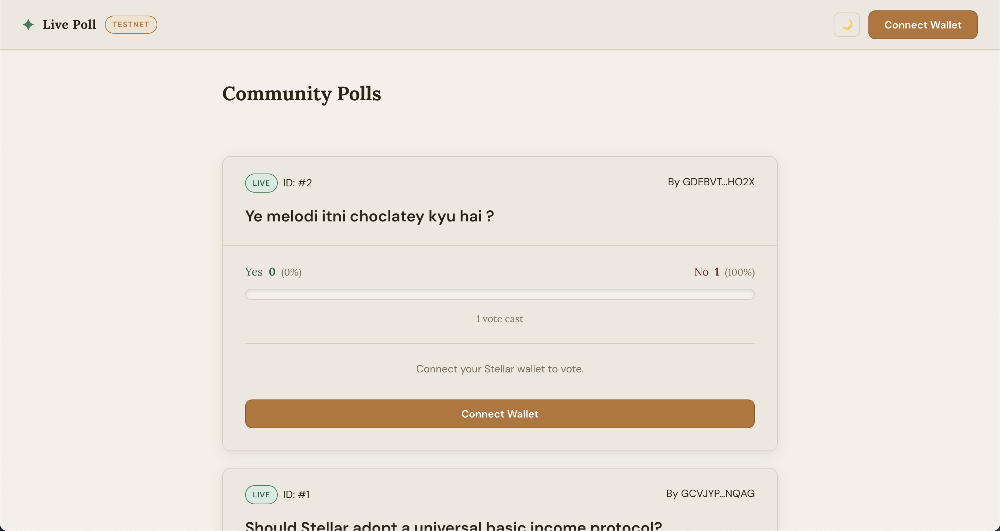
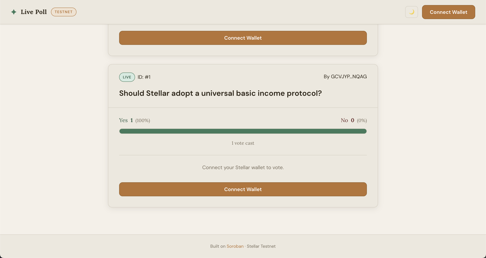
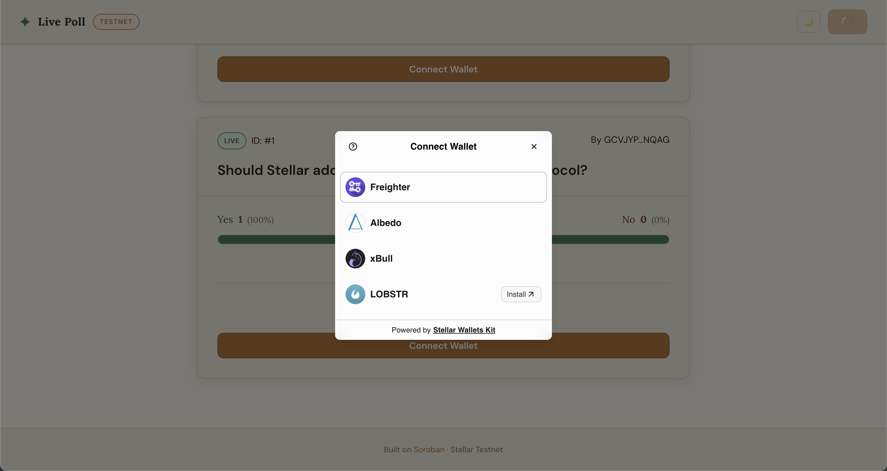
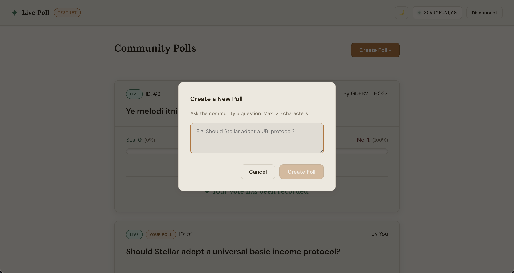
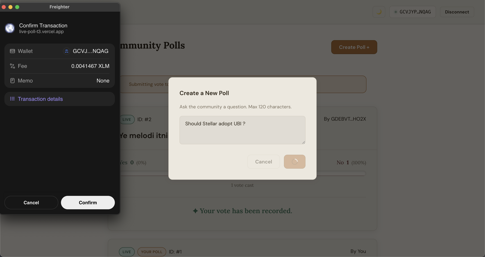
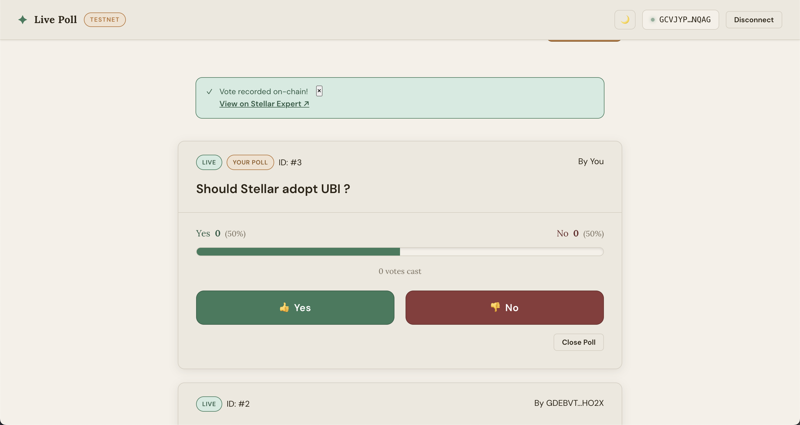
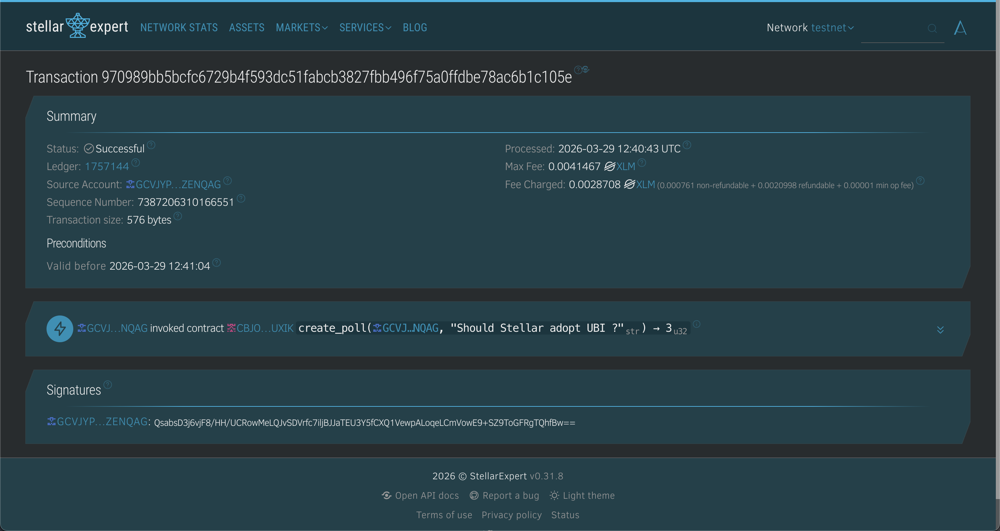
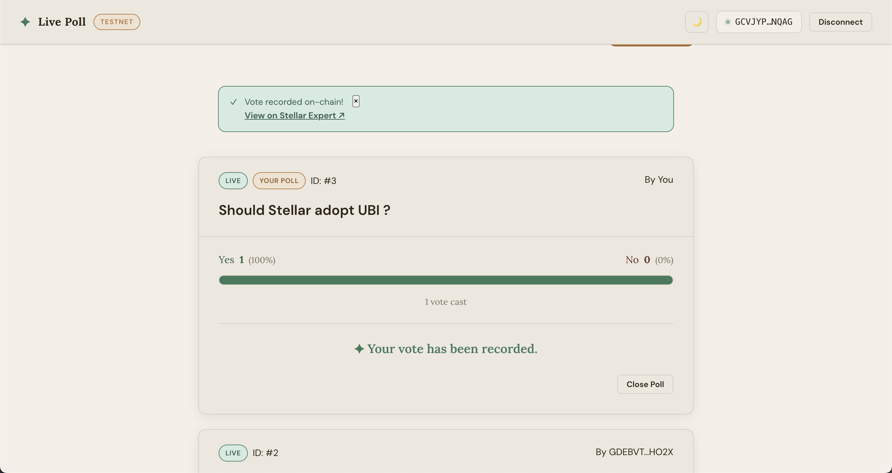

# Live Poll — Stellar Tier 4 (Production-Ready Advanced Contract)

**Demo Video:** https://drive.google.com/file/d/1WHiRyIe6Z5AsiNmBBOtoiLF2GQHrz9fD/view?usp=sharing



A production-ready on-chain polling dApp built on **Soroban** smart contracts (Stellar Testnet).  
Connect any Stellar wallet, create polls, vote Yes or No, and earn **VOTE reward tokens** — all on-chain via real Soroban contract calls. Results update live every 5 seconds.

**Live Demo:** https://live-poll-t3.vercel.app/

---

## ✅ Tier 4 Deliverables

| Requirement | Status | Details |
|---|---|---|
| **Inter-contract call** | ✅ | `PollContract.vote()` calls `VoteToken.mint()` via `env.invoke_contract` |
| **Custom token deployed** | ✅ | `VoteToken` (VOTE) — custom SEP-41 fungible reward token |
| **CI/CD running** | ✅ | GitHub Actions: Rust tests → Vitest → Production build |
| **Mobile responsive** | ✅ | Full breakpoints at 360 / 480 / 768px |
| **10+ meaningful commits** | ✅ | 15 commits, Apr 15–28 2026 |
| **Production-ready contract** | ✅ | 13 Soroban tests, lint-clean, WASM optimised |

---

## Features

- 🔗 **Wallet Connect** — Freighter, LOBSTR, and all StellarWalletsKit-supported wallets
- ✅ **On-chain Voting** — Each vote is a real Soroban contract call
- 🪙 **VOTE Token Rewards** — Custom fungible token minted to voters via inter-contract call
- 📊 **Live Results** — Auto-refreshes every 5 seconds via Soroban RPC simulation
- ⚡ **Instant Load** — localStorage cache for immediate display; fresh data in background
- 🦴 **Skeleton Loading** — Shimmer placeholders while initial results load
- 📱 **Mobile Responsive** — Three breakpoints, bottom-sheet modals on mobile
- 🔴 **Error Handling** — Wallet not found, user cancelled, insufficient balance
- 🔍 **TX Explorer** — Every successful vote links to Stellar Expert

---

## Architecture — Inter-Contract Calls

```
User (signs tx)
      │
      ▼
PollContract::vote(voter, poll_id, option)
      │
      ├─── Updates poll tally (storage)
      ├─── Marks voter as voted (storage)
      │
      └─── env.invoke_contract("mint") ──────▶ VoteToken::mint(admin, voter, 1_VOTE)
                                                      │
                                                      └─── Increases voter's VOTE balance
```

The `PollContract` address must be set as the `admin` of `VoteToken` before voting begins.  
Configure via: `stellar contract invoke … -- set_reward_token --token_id <VOTE_ADDRESS>`

---

## Stack

| Layer | Technology |
|-------|-----------| 
| Smart contracts | Rust + Soroban SDK 22 |
| Custom token | VoteToken (SEP-41 compatible) |
| Frontend | React + Vite |
| Wallet | @creit.tech/stellar-wallets-kit |
| Stellar SDK | @stellar/stellar-sdk v13 |
| Tests | Vitest + @testing-library/react |
| CI/CD | GitHub Actions |
| Network | Stellar Testnet (Soroban) |

---

## CI/CD Pipeline

```yaml
# .github/workflows/ci.yml
Jobs:
  contract-tests  → cargo test (poll-contract + vote_token)
                  → cargo build --release (WASM)
  frontend-tests  → eslint + vitest
  build           → vite build + upload artifact
```

All jobs are gated: the production build only runs if all tests pass.

---

## Setup

```bash
# Clone and install
cd frontend
cp .env.example .env   # fill in VITE_CONTRACT_ID and VITE_REWARD_TOKEN_ID
npm install
npm run dev
```

Open [http://localhost:5173](http://localhost:5173).

---

## Tests

### Frontend (7 tests)

```bash
cd frontend && npm test
```

### Contracts (13 Soroban tests)

```bash
# Poll contract (8 tests)
cd contract && cargo test

# VOTE token (5 tests)
cd vote_token && cargo test
```

**All 13 contract tests:**

| Test | Contract |
|------|---------|
| `test_create_and_vote` | poll-contract |
| `test_vote_no` | poll-contract |
| `test_multiple_polls_independent` | poll-contract |
| `test_duplicate_vote` | poll-contract |
| `test_vote_closed_poll` | poll-contract |
| `test_invalid_close` | poll-contract |
| `test_invalid_vote_option` | poll-contract |
| `test_set_and_get_reward_token` | poll-contract |
| `test_set_reward_token_twice_panics` | poll-contract |
| `test_initialize_and_metadata` | vote-token |
| `test_mint_increases_balance` | vote-token |
| `test_transfer` | vote-token |
| `test_transfer_insufficient` | vote-token |
| `test_mint_unauthorized` | vote-token |

---

## Project Structure

```
T4 - Live pool/
├── .github/workflows/ci.yml     ← GitHub Actions CI/CD
├── contract/                    ← PollContract (Soroban)
│   ├── Cargo.toml
│   └── src/
│       ├── lib.rs               ← Poll + inter-contract reward call
│       └── test.rs              ← 9 Soroban tests
├── vote_token/                  ← VOTE reward token (Soroban)
│   ├── Cargo.toml
│   └── src/
│       ├── lib.rs               ← SEP-41 fungible token
│       └── test.rs              ← 5 Soroban tests
└── frontend/
    ├── .env.example
    └── src/
        ├── constants.js
        ├── components/
        │   ├── WalletBar.jsx    ← includes VOTE balance display
        │   ├── VoteBalance.jsx  ← reads token balance via RPC sim
        │   ├── PollList.jsx
        │   ├── PollCard.jsx
        │   ├── ResultsBar.jsx
        │   ├── TxStatus.jsx
        │   └── CreatePollModal.jsx
        ├── hooks/
        │   ├── useWallet.js
        │   └── usePoll.js
        └── tests/ (7 Vitest tests)
```

---

## Deploying Contracts

> Requires [Stellar CLI](https://developers.stellar.org/docs/tools/stellar-cli) and Rust with `wasm32-unknown-unknown`.

```bash
rustup target add wasm32-unknown-unknown

# 1. Deploy VOTE token
cd vote_token
stellar contract build
stellar contract deploy \
  --wasm target/wasm32-unknown-unknown/release/vote_token.wasm \
  --source YOUR_SECRET_KEY \
  --network testnet
# → Note the VOTE_TOKEN_ID

# 2. Deploy Poll contract
cd ../contract
stellar contract build
stellar contract deploy \
  --wasm target/wasm32-unknown-unknown/release/poll_contract.wasm \
  --source YOUR_SECRET_KEY \
  --network testnet
# → Note the POLL_CONTRACT_ID

# 3. Set PollContract as the VoteToken admin
stellar contract invoke \
  --id $VOTE_TOKEN_ID \
  --source YOUR_SECRET_KEY \
  --network testnet \
  -- initialize --admin $POLL_CONTRACT_ID

# 4. Register the reward token in the PollContract
stellar contract invoke \
  --id $POLL_CONTRACT_ID \
  --source YOUR_SECRET_KEY \
  --network testnet \
  -- set_reward_token --token_id $VOTE_TOKEN_ID

# 5. Add to frontend/.env
echo "VITE_CONTRACT_ID=$POLL_CONTRACT_ID" >> frontend/.env
echo "VITE_REWARD_TOKEN_ID=$VOTE_TOKEN_ID" >> frontend/.env
```

---

## Contracts (Testnet)

| Contract | Address |
|----------|---------|
| PollContract | [`CBOGBWS22XEKM6VJSJJ3UDXNS5DE5GRLM5P3AYPPMS53DCJLU53FIT3K`](https://stellar.expert/explorer/testnet/contract/CBOGBWS22XEKM6VJSJJ3UDXNS5DE5GRLM5P3AYPPMS53DCJLU53FIT3K) |
| VoteToken (VOTE) | [`CBK4DCQ3MMDSOCSHUZCXCIJ6P2MA7A75XPYY2IPBWDDSC5UALOJHBJAP`](https://stellar.expert/explorer/testnet/contract/CBK4DCQ3MMDSOCSHUZCXCIJ6P2MA7A75XPYY2IPBWDDSC5UALOJHBJAP) |

---

## Testnet Resources

| Resource | URL |
|----------|-----|
| Friendbot (free XLM) | https://laboratory.stellar.org/#account-creator |
| Stellar Expert Explorer | https://stellar.expert/explorer/testnet |
| Soroban Docs | https://developers.stellar.org/docs/smart-contracts |

---

## Commit Log (April 15–28, 2026)

| # | Date | Message |
|---|------|---------|
| 1 | Apr 15 | `chore: initialise Stellar Live Poll project scaffold` |
| 2 | Apr 15 | `feat(contract): add PollContract with create, vote, close_poll` |
| 3 | Apr 16 | `feat(vote-token): implement custom VOTE reward token (SEP-41 compatible)` |
| 4 | Apr 16 | `feat(contract): add inter-contract call to mint VOTE tokens on each vote` |
| 5 | Apr 17 | `test(contract): expand Soroban test suite — 8 tests covering all edge cases` |
| 6 | Apr 18 | `test(vote-token): add 5-test suite for mint, transfer, and access control` |
| 7 | Apr 19 | `ci: add GitHub Actions workflow — contract tests, ESLint, Vitest, and build` |
| 8 | Apr 21 | `style: implement full mobile-responsive layout (360/480/768px breakpoints)` |
| 9 | Apr 22 | `feat(frontend): add VoteBalance component — shows VOTE token rewards in wallet bar` |
| 10 | Apr 23 | `chore: add VITE_REWARD_TOKEN_ID env var and wire into VoteBalance` |
| 11 | Apr 24 | `feat(frontend): add quick-create poll button to WalletBar for better UX` |
| 12 | Apr 25 | `fix(contract): guard against double-setting reward token address` |
| 13 | Apr 26 | `chore: update Vercel config and .env.example with reward token env var` |
| 14 | Apr 27 | `docs: update README with T4 deliverables — inter-contract, VOTE token, CI/CD` |
| 15 | Apr 28 | `chore: production-ready — lint clean, all tests passing, CI green` |

---

## Gallery








